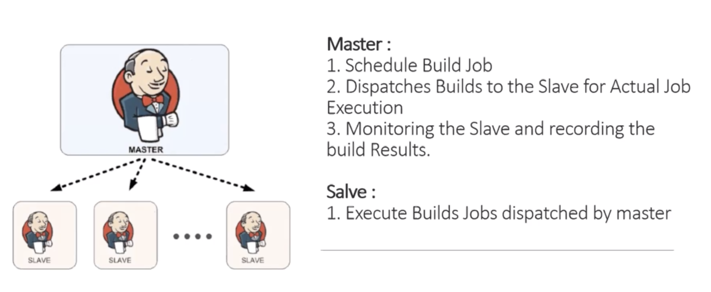

## What is DevOps and Role of DevOps
Continuous development & monitoring & testing -> Continuous integration -> continuous deployment
Integrations of:
Plan -> code -> build -> test
Deploy -> operate -> monitor

* **Continuous Development**: planning and coding, Version Control(GIT)
* **Continuous Testing**: testing, Junit
* **Continuous Integration**: auto build, auto test, locate error, Jenkins
* **Continuous Deployment and Monitoring**: 
    **Configuration management**
    * Establish and maintain Application's functional requirements
    * Releasing deployments to servers
    * Scheduling Updates on all servers
    * Maintain Configuration Consistency on all servers
    **Containerization**
    * Maintain the consistency across the environments
    * Use Docker as contain containerization tool
    * Scheduling updates on all servers
    * Maintain Configuration consistency on all servers
    **Monitoring**
    * Monitor the System Performance
    * Monitor the Product overall Performance

## Version Control System (GIT)

**GIT WorkFlow (3 Stages)**
* Working area
* Staging area
* Respository

```bash
git config --list
git config --global user.email
git config --global user.name
git init
git status
git add .
git add fileName 
git commit -m "Message"
git log
git log --author="name"
git diff
git diff --staged
```
```bash
Working with Github
git remote add origin url
git status
git add .
git commit -m "Message"
git push origin master
git pull origin master
```
```bash
Branch
git branch new-branch-name      -create new branch
git branch                      -see all branch
git checkout branch-name        -switch to branch
Merge other branch to master
git checkout master
git merge source-branch-name
git checkout source-branch-name
git push origin source-branch-name
```
```bash
git reset HEAD file name        -remove from staging
git reset HEAD~                 -remove from commit

```


          Distributed Version Control System

                    GITHUB
            /           |           \          Pull/Push
           /            |            \
          GIT          GIT            GIT
          |             |              |     Commit/Update
          |             |              |
        LOCAL1         LOCAL2         LOCAL3


## Maven
**What is Maven?**
Build tool to help building projects, automates everything related to building software project.

**Why need Maven?**
Centralized location what kind of dependency you require.

**Download/Install**
https://maven.apache.org/download.cgi
Move unzip file to directory /Applications
```bash
cd /Users/username
open -e .bash_profile
export M2_HOME=/Applications/apache-maven-version
export PATH=$PATH:$M2_HOME/bin
```
close terminal
open new terminal mvn -version

**Generate Maven Project**
* In working directory
```bash
mvn archetype:generate
mvn eclipse:eclipse
```
* File Structure
pom.xml -> dependencies
main -> application code
test -> test code
* In put into Eclipse
Import -> General -> Existing Project into Workspace

* Maven Project Life Cycle
    * **Validate**: validate proejct is correct, all necessary information available
    ```bash
    $ mvn validate
    ```
    * **Compile**: compile source code for the project
     ```bash
    $ mvn compile
    ```
    * **Test**: test source code using a suitable unit test framework
     ```bash
    $ mvn test
    ```
    * **Package**: take compile code and package it in its distributable format, such as Jar
    ```bash
    $ mvn package
    ```
    * **Clean**: clean all the unnecessary files
    ```bash
    $ mvn clean
    ```
    * **Install**: install package into local repository, for use as a dependency in other project locally
    ```bash
    $ mvn install
    ```
    * **Deploy**: done in build environment, copies final package to the remote repository for sharing with other developers and projects
    ```bash
    $ mvn deploy
    ```
* POM.xml: A project object model, contains all the information about project and configuration details.
>Search package in https://mvnrepository.com/repos/central
to find all open source/packages with all the versions. Copy paste the dependency into POM.xml file should work.

## Continuous Integration (Jenkins)
A process of Automated Build and Automated Tests. Example: download shared code from a group, use Maven to build, then Junit to test. It helps to detect error, loacte error. Not resolve bug, but find bug quickly. Able to set up auto build from time frame.
* **Benefit of CI**:
    * No long and tense integration
    * Catch error easier
    * Don't have to wait to find out if your code work(can be done auto in setting time)

* **Download and Install Jenkins**
```bash
https://jenkins.io/download/
Choose Long term support Generic Java Package
java -jar /Users/lxn/Downloads/jenkins.war --httpPort=7070
Or default at port 8080
```
* **Jenkins Architecture** 

    * `Jenkins job`: runnable task that are controlled and monitored by Jenkins
    * `Slave/Node`: computers that are setup to build Projects for a Master
        * Jenkins run separate program called `Slave Agents` on Slaves
        * When Slaves are registered to a master, a master starts distributing the load to Slaves.
        * Node is referring to all machines that are part of Jenkins grid, slaves and master.
        * Executor is a single thread executing a single job on a slave, can be parallel to other executors in a slave.
        * `Plugin` is a piece of software that extends core functionaliy of the core Jenkins Server.


## Docker Containers

## Docker Networking

## Docker Swarm

## Application Build Tool
