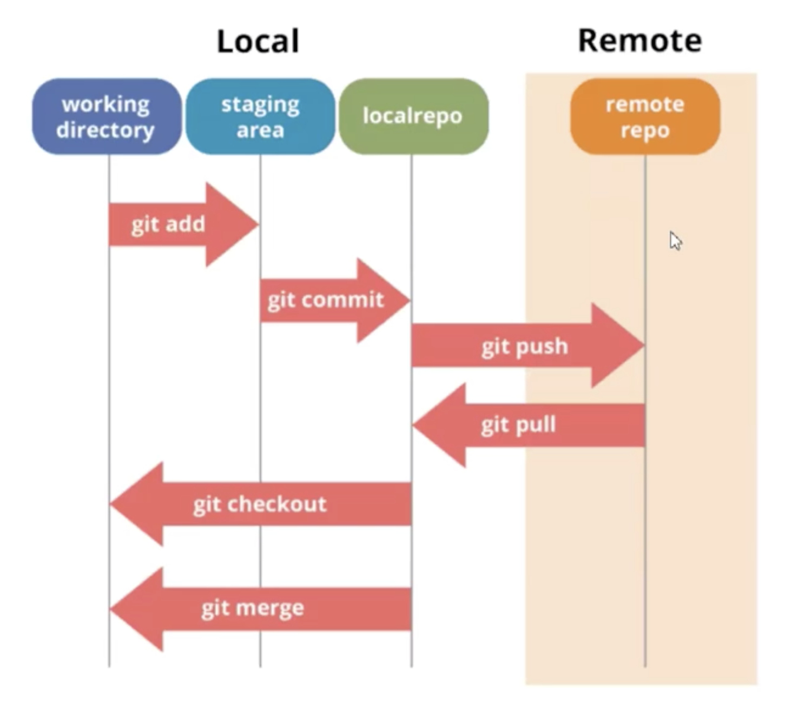

## What is DevOps and Role of DevOps
Continuous development & monitoring & testing -> Continuous integration -> continuous deployment
Integrations of:
Plan -> code -> build -> test
Deploy -> operate -> monitor

* **Continuous Development**: planning and coding, Version Control(GIT)
* **Continuous Testing**: testing, Junit
* **Continuous Integration**: auto build, auto test, locate error, Jenkins
* **Continuous Deployment and Monitoring**: 
    **Configuration management**
    * Establish and maintain Application's functional requirements
    * Releasing deployments to servers
    * Scheduling Updates on all servers
    * Maintain Configuration Consistency on all servers
    **Containerization**
    * Maintain the consistency across the environments
    * Use Docker as contain containerization tool
    * Scheduling updates on all servers
    * Maintain Configuration consistency on all servers
    **Monitoring**
    * Monitor the System Performance
    * Monitor the Product overall Performance

## Version Control System (GIT)

**GIT WorkFlow (3 Stages)**
* Working area
* Staging area
* Respository

```bash
git config --list
git config --global user.email
git config --global user.name
git init
git status
git add .
git add fileName 
git commit -m "Message"
git log
git log --author="name"
git diff
git diff --staged
```
```bash
Working with Github
git remote add origin url
git status
git add .
git commit -m "Message"
git push origin master
git pull origin master
```
```bash
Branch
git branch new-branch-name      -create new branch
git branch                      -see all branch
git checkout branch-name        -switch to branch
Merge other branch to master
git checkout master
git merge source-branch-name
```


          Distributed Version Control System

                    GITHUB
            /           |           \          Pull/Push
           /            |            \
          GIT          GIT            GIT
          |             |              |     Commit/Update
          |             |              |
        LOCAL1         LOCAL2         LOCAL3


## Continuous Integration (Jenkins)

## Docker Containers

## Docker Networking

## Docker Swarm

## Application Build Tool
